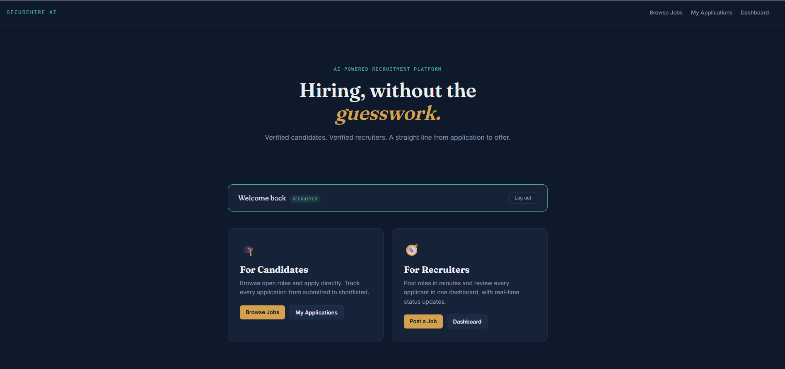
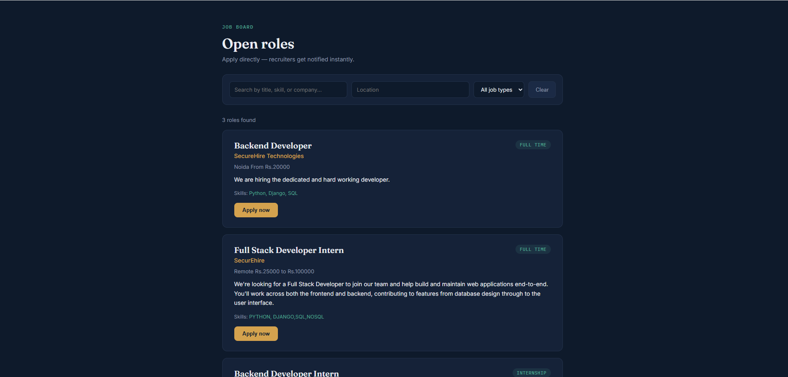
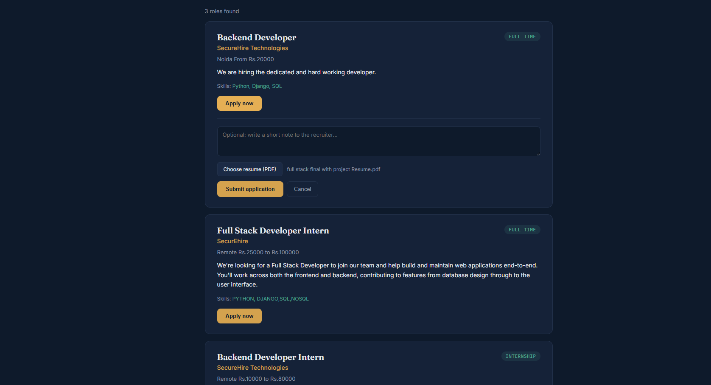
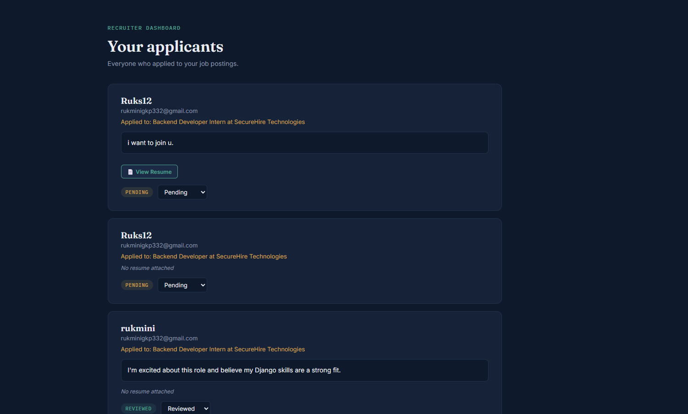
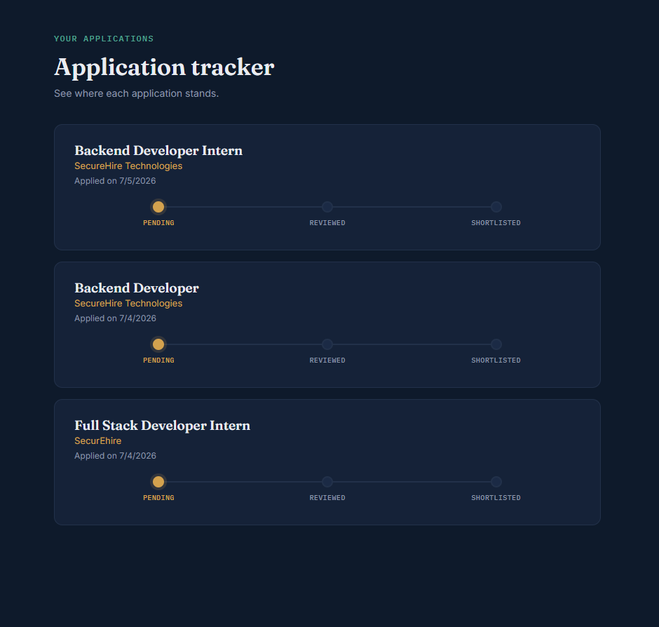

# SecureHire AI

An AI-assisted recruitment platform connecting candidates and recruiters, built end-to-end with Django and Django REST Framework. Supports role-based authentication, job posting, search/filtering, resume uploads, and a live application-tracking workflow for both sides of the hiring process.

## Features

### Authentication

- Custom User model with role-based accounts (Candidate / Recruiter)
- JWT authentication (access + refresh tokens) via djangorestframework-simplejwt
- Role embedded directly in the JWT payload for client-side role detection
- Custom-designed registration and login pages

### For Recruiters

- Post job listings (title, company, location, type, salary range, required skills)
- Recruiter-only permission enforced at the API level (IsRecruiter)
- Dashboard to view all applicants across posted jobs
- Update application status (Pending, Reviewed, Shortlisted, Rejected) with live saving
- View and download candidate resumes directly from the dashboard

### For Candidates

- Browse all active job listings
- Search by title, skill, or company name; filter by location and job type
- Apply to jobs with a cover letter and PDF resume upload
- Duplicate-application prevention (one application per job per candidate)
- Personal application tracker showing real-time status per application

### Platform

- Role-aware homepage with dynamic navigation based on login state
- Fully permission-protected REST API - every write action checks both authentication and role
- Clean separation of concerns across three Django apps: accounts, jobs, applications

## Screenshots

### Homepage

### Browse Jobs (Search & Filter)

### Job Application with Resume Upload

### Recruiter Dashboard

### Application Tracker (Candidate View)

## Tech Stack

- Backend: Django 6.0, Django REST Framework
- Auth: djangorestframework-simplejwt (JWT)
- Database: SQLite (development)
- Frontend: Server-rendered HTML/CSS/JavaScript (vanilla, no framework) calling the DRF API via fetch
- Environment management: python-dotenv / django-environ

## API Endpoints

| Method | Endpoint                            | Description                                              | Auth Required  |
| ------ | ----------------------------------- | -------------------------------------------------------- | -------------- |
| POST   | /api/accounts/register/             | Register a new user                                      | No             |
| POST   | /api/accounts/login/                | Log in, receive JWT tokens                               | No             |
| POST   | /api/jobs/create/                   | Post a new job                                           | Recruiter only |
| GET    | /api/jobs/list/                     | Browse jobs (supports search, location, job_type params) | No             |
| POST   | /api/applications/apply/            | Apply to a job (multipart, supports resume file)         | Candidate only |
| GET    | /api/applications/mine/             | View own applications                                    | Candidate only |
| GET    | /api/applications/recruiter/        | View applicants to own job postings                      | Recruiter only |
| PATCH  | /api/applications/id/update-status/ | Update an applicant status                               | Recruiter only |

## Setup

1. Clone and enter the project
   git clone your-repo-url
   cd securehireai

2. Create and activate a virtual environment
   python -m venv venv
   venv\Scripts\activate (Windows)
   source venv/bin/activate (Mac/Linux)

3. Install dependencies
   pip install -r requirements.txt

4. Configure environment variables

   Create a .env file in the project root with:
   SECRET_KEY=your-secret-key-here
   DEBUG=True
   ALLOWED_HOSTS=127.0.0.1,localhost

5. Run migrations
   python manage.py migrate

6. Create a superuser
   python manage.py createsuperuser

7. Run the development server
   python manage.py runserver

   Visit http://127.0.0.1:8000/

## Key Pages

| Page                        | URL                                     |
| --------------------------- | --------------------------------------- |
| Homepage                    | /                                       |
| Register                    | /api/accounts/register-page/            |
| Login                       | /api/accounts/login-page/               |
| Browse Jobs                 | /api/jobs/browse-jobs-page/             |
| Post a Job (Recruiter)      | /api/jobs/post-job-page/                |
| Recruiter Dashboard         | /api/applications/dashboard-page/       |
| My Applications (Candidate) | /api/applications/my-applications-page/ |

## Future Improvements

- Email notifications on application status changes
- AI-powered resume screening and candidate-job matching
- Pagination for job listings and applicant lists
- Rich-text job descriptions
- Recruiter analytics (applications per job, hiring funnel metrics)

## Author

Rukmini - B.Tech CSE/IT, Ajay Kumar Garg Engineering College

LinkedIn: linkedin.com/in/rukmini-96b005287
GitHub: github.com/rukmini12438
